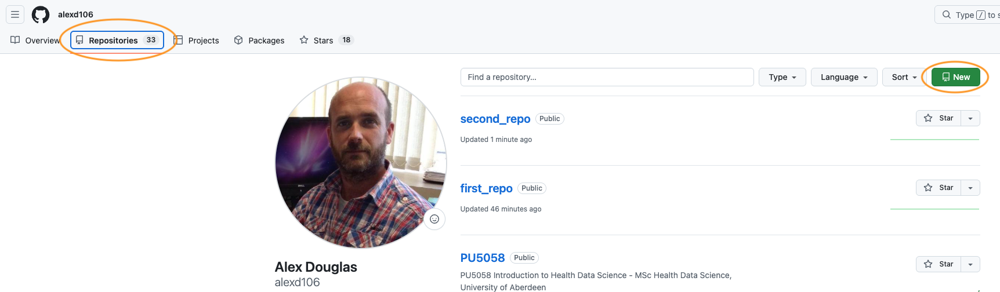
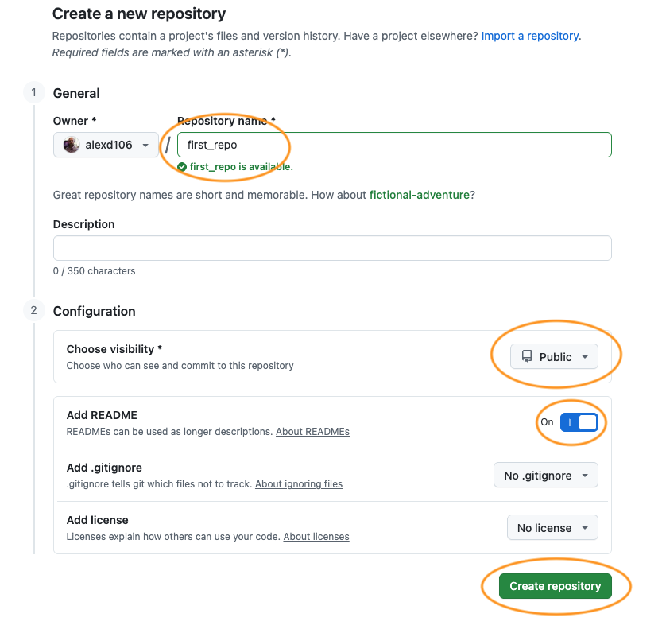
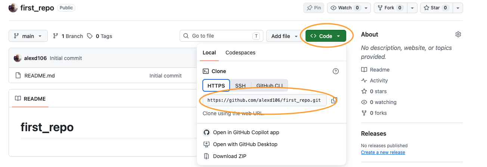
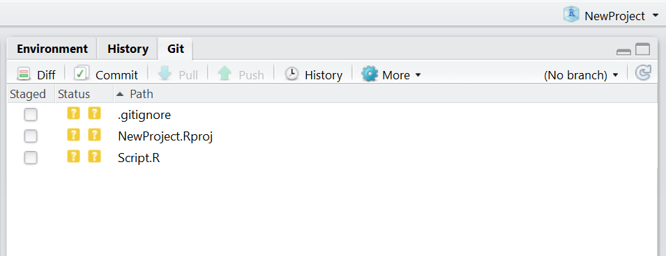
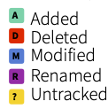
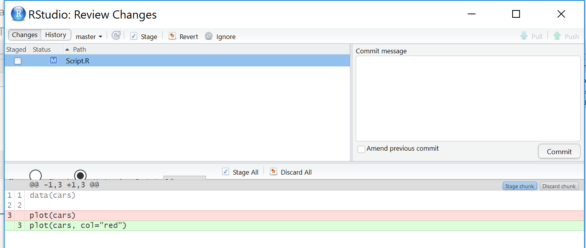

```{r setup, echo=FALSE, purl = FALSE}
knitr::opts_chunk$set(echo=TRUE, message = FALSE, warning = FALSE, eval = FALSE, cache = FALSE)
options(width = 80)
SOLUTIONS <- TRUE
```

\  

## Exercise 9: Version control with Git and GitHub

\  

Read [Chapter 9](https://intro2r.com/github_r.html) to help you complete the questions in this exercise.

\  

**Before the session.** This exercise assumes Git is installed, you have a GitHub account, and RStudio can authenticate with it. That takes about half an hour and is fiddly the first time, so please work through the **[Setting up Git and GitHub](git_setup.html){target="_blank"}** page before you arrive. If you hit a real problem, bring it to the start of the session and we'll help you, but we can't get everybody set up and still teach anything, so please try first.

\  

Up to now your safety net has been saving your script and hoping for the best. Version control gives you something a good deal better. It keeps a record of every version of your work, along with who changed what, when, and why. If you've ever ended up with a folder containing `analysis_final_v2_REALLY_final.R`, this is the thing that saves you from it.

Git is the program that keeps that history on your computer. GitHub is a website that keeps a copy, which makes it a backup, a way to share work, and somewhere to point people who ask what you've been doing.

We'll only cover the everyday loop in this exercise, which is what you'll use ninety-nine times out of a hundred.

\  

1\. Start by checking your setup is healthy. In the R console run the situation report:

```{r Q1, echo=TRUE, class.source="fold-none"}
library(usethis)

git_sitrep()
```

This prints a lot at once, which is normal. You're looking for just two things, circled below: your name and email address near the top under the Git global heading, and a line further down confirming that a personal access token was found. Everything else you can ignore for now.


If either of those is missing, go back to the [setup page](git_setup.html){target="_blank"} and work out which step didn't take. Ask for help now rather than at Q4, when the symptom will be an error message rather than a missing line.

\  

2\. Now create somewhere for your work to live. We're going to make the repository on GitHub first and then bring it down to your computer, because that way the two ends are connected from the start and there's less to go wrong.

a) Go to [github.com](https://github.com) and log in. Click the **+** in the top right and choose **New repository**. If you can't see it, your **Repositories** tab has a green **New** button that does the same thing.



b) Name it `pu5058-practical`. Leave the visibility as **Public**. Switch **Add README** on. Then, in the **Add .gitignore** dropdown just below it, choose the **R** template, which the screenshot below does not have set. Click **Create repository**.



c) On the page that appears, click the green **Code** button, make sure **HTTPS** is selected rather than SSH, and copy the web address. It will end in `.git`.



d) In RStudio, go to `File` -> `New Project...`. Choose **Version Control**, then **Git**. Paste the address into the 'Repository URL' box. The 'Project directory name' box fills in on its own. Under 'Create project as a subdirectory of', browse to wherever you keep your work for this course, then click **Create Project**.

If there's no **Version Control** option in that first window, RStudio hasn't found Git on your computer. That's Step 3 of the [setup page](git_setup.html){target="_blank"}, and the situation report in Q1 doesn't check it, so this is where you find out.

RStudio restarts and opens a new Project containing the README and the `.gitignore` that GitHub made for you. You now have the same repository in two places, one on your computer and one on GitHub. Keeping those two in step is what the rest of this exercise is about.

Note this is a *different* Project from the one you've used for Exercises 1 to 7. That's deliberate, so you're not putting the whole course under version control today.

\  

3\. Before you touch anything, get your bearings. Find the **Git** tab in RStudio, which unless you've moved your panes around will be in the top right one alongside Environment and History. It only appears in a Project that's under version control, which is why Q2 came first.

There isn't much in it yet. You should see a single file, `pu5058-practical.Rproj`, which is the Project file RStudio made for you a moment ago. Everything else that came down from GitHub is already being looked after by Git, so there's nothing to report about it.

Find each of these, without clicking yet:

- the **Staged** column of tick boxes
- the **Diff** button, which shows you what changed
- the **Commit** button
- the **Pull** and **Push** buttons, the down and up arrows
- the **History** button, the little clock



The coloured icon beside a file tells you what Git currently makes of it. A yellow `?` means Git can see the file but isn't keeping track of it, which is the case for `pu5058-practical.Rproj` right now. You'll meet a blue `M` for a file that's been modified and a green `A` for one you've staged as you work through the next few questions. Here is the full set:



\  

4\. Time for the full cycle, once, slowly. First you'll need something worth saving, and rather than invent something you'll use the report you built in Exercise 7.

a) That report needs two folders alongside it to knit, so using your computer's file manager (Finder on a Mac, File Explorer on Windows) copy all three of these into your new Project folder:

- `cardiac_report.Rmd` itself
- a `data` folder containing `cardiacdata.txt`
- an `output` folder containing `ex6_admissions.png`

The paths written inside the report are relative to the `.Rmd` file, so those two folders have to keep their names and sit right next to it. You're copying rather than moving because this is a different Project from the one you've been working in. If you haven't got a working report of your own, download the finished one from the [Exercise 7 solutions](exercise_7_solution.html){target="_blank"}.

b) Open `cardiac_report.Rmd` in RStudio and knit it. Do this before you go anywhere near Git, so that you know it works in its new home. Knitting also produces `cardiac_report.pdf`, which you'll come back to in Q8.

c) Now look at the Git pane. Several things have appeared, all with a yellow `?`, because Git can see them but isn't keeping track of any of them yet. Tick the **Staged** box next to `cardiac_report.Rmd` and that one only. Its icon changes to a green `A`, for 'added'. Leaving the others alone is the point here: you choose what goes into a commit rather than sweeping up everything that happens to be lying around.

d) Click **Commit**. A window opens showing the file you staged and, underneath, every line you're about to record. Type a message in the box on the right. Make it say why you made the change rather than just what you changed. 'add cardiac report from Exercise 7' is a useful message, 'update' is not, and in six months you'll be grateful. Click the **Commit** button, read the confirmation, and close it.


e) Your change is now saved in the history on your computer, but GitHub knows nothing about it. Click the green **Push** arrow. Wait for it to finish, then go to your repository page on GitHub in your browser and refresh. Your report is there.

If the push fails with a message about authentication, your token is the problem rather than anything you've done here. See the last section of the [setup page](git_setup.html){target="_blank"}.

\  

5\. Now do it again, because the loop only becomes useful once it's automatic. Open `cardiac_report.Rmd` and make a small change to the writing, a sentence added to your data validation section will do, then knit it and save. The file reappears in the Git pane, this time with a blue `M` for 'modified'.

a) Before you commit, select the file and click **Diff**. Read what it shows you: added lines in green, removed lines in red, and the unchanged lines around them for context. Getting into the habit of looking at the diff before committing catches an enormous number of mistakes.



Notice that the diff is of your `.Rmd` file rather than the PDF. Git is designed for plain text, which is exactly what an R markdown file is, and it is one of the reasons for writing a report this way rather than in Word.

b) Stage, commit with a sensible message, and push.

c) Now click **History**, the clock icon. You should see both of your commits, most recent first, with their messages, authors and dates. Click on the first commit to see exactly what it contained. This history is the part that makes version control worth the trouble. The backup is useful, but being able to look back at what you did, and why you did it, is more useful still.

\  

6\. Everyone makes changes they wish they hadn't. Git gives you a way back.

a) Open your report, delete the whole `chol-plot` chunk that draws the boxplot, and save it. Do **not** commit. Now, in the Git pane, right-click on the file and choose **Revert**. Say yes to the warning, then look at your report again and the deleted chunk is back.

Be careful with this one. It's not an undo button. It throws away *everything* you've changed since your last commit, not just the last thing you did, and there's no way back. Commit often and you'll rarely need it.

b) Now a subtler one. Commit a change, but **do not push it**. Realise you forgot to include something, add it, and then in the Commit window tick **Amend previous commit** before committing again. Rather than making a second commit, this folds your new change into the previous one. This is only safe before you push. Once a commit is on GitHub, other people may have it, and rewriting it causes them problems.

\  

7\. So far everything has flowed from your computer to GitHub. It flows the other way too, and this is the half people forget.

a) In your browser, open your repository on GitHub, click on `README.md`, and click the pencil icon to edit it. Write a couple of sentences describing what the project is for, then commit the change. GitHub asks you for a commit message in much the same way RStudio does.

b) Your computer knows nothing about this. In RStudio, click **Pull**, the blue down arrow. Open the README in RStudio and your change is there.

c) Now think about why this matters. If you'd edited the README on your computer as well before pulling, Git would have had two different versions of the same file and would have asked you to sort it out. That's a merge conflict, and it's why the advice is always **pull before you push**. Get into the habit now, while you're working alone and there's nothing to conflict with.

\  

8\. Finally, what not to put in a repository. Open the `.gitignore` file in your Project. This is the list of things Git deliberately ignores, and GitHub gave you a sensible starting one when you chose the R template in Q2.

a) Read through it. You should recognise `.Rhistory` and `.RData`.

b) Look back at the Git pane. `cardiac_report.pdf` is still sitting there with a yellow `?` from Q4, and it will reappear every time you knit. It doesn't need a history, because anybody with your `.Rmd` file and the data can produce it again in one click. Add a line to `.gitignore` that ignores it and watch it disappear from the pane.

`````{asis, echo=SOLUTIONS}
````{.md .foldable}
cardiac_report.pdf
````

Or, to catch every PDF the Project ever produces:

````{.md .foldable}
*.pdf
````
`````

c) Right-click a file in the Git pane and notice there's an **Ignore** option, which adds it to `.gitignore` for you.

d) Now a judgement call, because 'ignore anything you generated' is too blunt a rule. Your `output` folder holds `ex6_admissions.png`, and your report can't knit without it. If you ignored that folder, anybody who cloned your repository would get a report that fails on the last figure. The question to ask is not 'did I generate this?' but 'could somebody rebuild it from what is already in the repository?'. The PDF, yes. The png, no, because you made it in a different Project from data that isn't here.

e) Last of all, think about your data. `cardiacdata.txt` is small, unchanging and not confidential, so committing it is reasonable and makes the project self-contained. Real patient data would be a different matter entirely. **Never put confidential data or passwords in a repository**, and be especially careful with public ones, because deleting a file doesn't remove it from the history.

Stage and commit whatever you have decided should be in there, push, and you're done.

\  

### Where to go next

\  

Git can do a great deal more than this. **Branches** let you work on something risky without disturbing the version that works. **Forks** and **pull requests** are how people contribute to each other's projects. **Merge conflicts**, which you'll meet the first time you and somebody else edit the same file, have their own set of tools. None of that is needed for this course, and all of it is easier to learn once the everyday loop in this exercise is second nature.

When you want to go further, the standard reference for R users is [Happy Git and GitHub for the useR](https://happygitwithr.com), which is free online. Section [9.6.4](https://intro2r.com/use_git.html) of the Introduction to R book gives an overview of how collaboration works.

One last thing. The website you're reading this on is built from a public GitHub repository, using exactly the tools in this exercise. The **Source code** link in the menu at the top of this page will take you to it.

\  

End of Exercise 9
