```{r setup, echo=FALSE, purl = FALSE}
knitr::opts_chunk$set(echo=TRUE, message = FALSE, warning = FALSE, eval = FALSE, cache = FALSE)
options(width = 80)
SOLUTIONS <- TRUE
```

\  

## Exercise 9: Version control with Git and GitHub

\  

Read [Chapter 9](https://intro2r.com/github_r.html) to help you complete the questions in this exercise.

\  

**Before the session.** This exercise assumes Git is installed, you have a GitHub account, and RStudio can authenticate with it. That takes about half an hour and is fiddly the first time, so please work through the **[Setting up Git and GitHub](git_setup.html){target="_blank"}** page before you arrive. If you hit a real problem, bring it to the start of the session and we'll help you, but we can't get everybody set up and still teach anything, so please try first.

\  

Up to now your safety net has been saving your script and hoping for the best. Version control gives you something a good deal better. It keeps a record of every version of your work, along with who changed what, when, and why. If you've ever ended up with a folder containing `analysis_final_v2_REALLY_final.R`, this is the thing that saves you from it.

Git is the program that keeps that history on your computer. GitHub is a website that keeps a copy, which makes it a backup, a way to share work, and somewhere to point people who ask what you've been doing.

We'll only cover the everyday loop in this exercise, which is what you'll use ninety-nine times out of a hundred. You'll get Git working on your own computer first, in Q1 to Q7, and only then bring GitHub into it. Keeping those two apart in your head from the start makes the whole thing a good deal easier to reason about when something goes wrong.

\  

1\. Start by checking your setup is healthy. In the R console run the situation report:

```{r Q1, echo=TRUE, class.source="fold-none"}
library(usethis)

git_sitrep()
```

This prints a lot at once, which is normal. You're looking for just two things. Your name and email address near the top, under the Git global heading, and a line further down confirming that a personal access token was found. There's a picture of both at Step 7 of the [setup page](git_setup.html){target="_blank"}. Everything else you can ignore for now.

If either of those is missing, go back to the [setup page](git_setup.html){target="_blank"} and work out which step didn't take. Ask for help now rather than at Q4, when the symptom will be an error message rather than a missing line.

\  

2\. Now create somewhere for your work to live. We're going to make the repository on GitHub first and then bring it down to your computer, because that way the two ends are connected from the start and there's less to go wrong.

a) Go to [github.com](https://github.com) and log in. Click the **+** in the top right and choose **New repository**. If you can't see it, your **Repositories** tab has a green **New** button that does the same thing.

b) Name it `pu5058-practical`. Leave the visibility as **Public**. Switch **Add README** on. Then, in the **Add .gitignore** dropdown just below it, choose the **R** template. That last one is easy to miss and it saves you a job later, so check your form looks like this before you click **Create repository**.

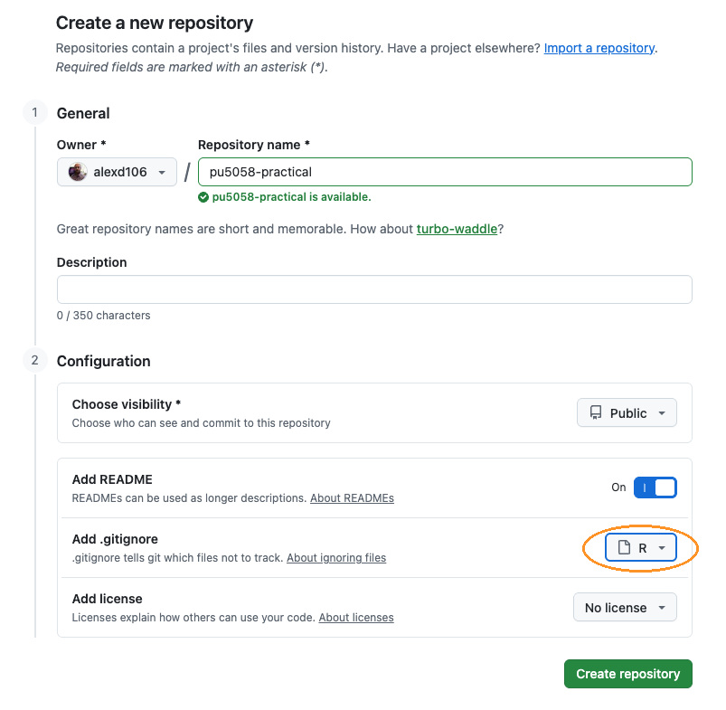{alt="The GitHub new repository form, filled in, with the gitignore dropdown set to R"}

\  

c) On the page that appears, click the green **Code** button, make sure **HTTPS** is selected rather than SSH, and copy the web address. It will end in `.git`.

d) In RStudio, go to `File` -> `New Project...`. The window that opens gives you three ways to make a Project, and you want the third one.

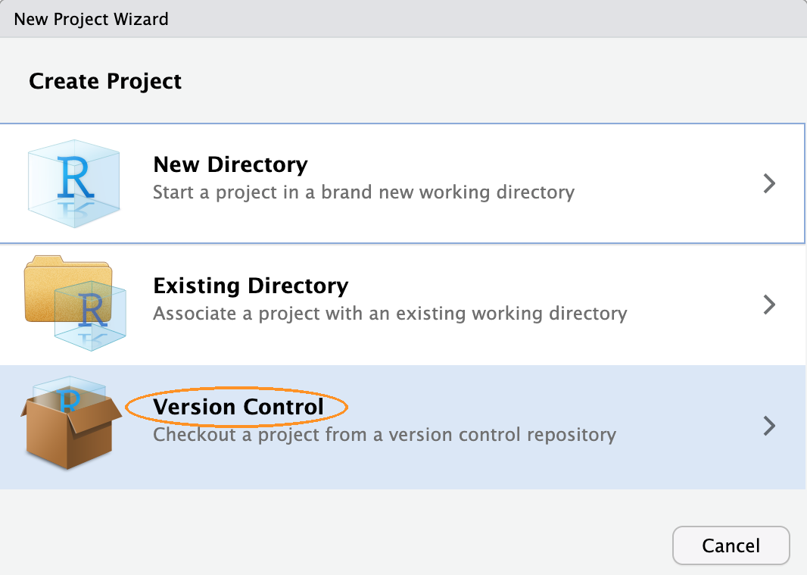{alt="The New Project Wizard showing New Directory, Existing Directory and Version Control"}

\  

Choose **Version Control**, then **Git**. Paste the address into the 'Repository URL' box. The 'Project directory name' box fills in on its own. Under 'Create project as a subdirectory of', browse to wherever you keep your work for this course, then click **Create Project**.

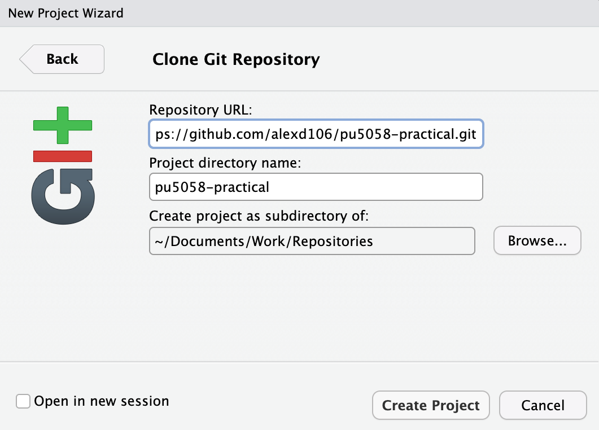{alt="The Clone Git Repository dialogue with the repository URL and project directory name filled in"}

\  

If there's no **Version Control** option in that first window, RStudio hasn't found Git on your computer. That's Step 3 of the [setup page](git_setup.html){target="_blank"}, and the situation report in Q1 doesn't check it, so this is where you find out.

RStudio restarts and opens a new Project containing the README and the `.gitignore` that GitHub made for you. You now have the same repository in two places, one on your computer and one on GitHub. Keeping those two in step is what the rest of this exercise is about.

Note this is a *different* Project from the one you've used for Exercises 1 to 7. That's deliberate, so you're not putting the whole course under version control today.

\  

3\. Before you touch anything, get your bearings. Find the **Git** tab in RStudio, which unless you've moved your panes around will be in the top right one alongside Environment and History. It only appears in a Project that's under version control, which is why Q2 came first.

There isn't much in it yet. You should see a single file, `pu5058-practical.Rproj`, which is the Project file RStudio made for you a moment ago. Everything else that came down from GitHub is already being looked after by Git, so there's nothing to report about it.

Find each of these, without clicking yet:

- the **Staged** column of tick boxes
- the **Diff** button, which shows you what changed
- the **Commit** button
- the **Pull** and **Push** buttons, the down and up arrows
- the **History** button, the little clock

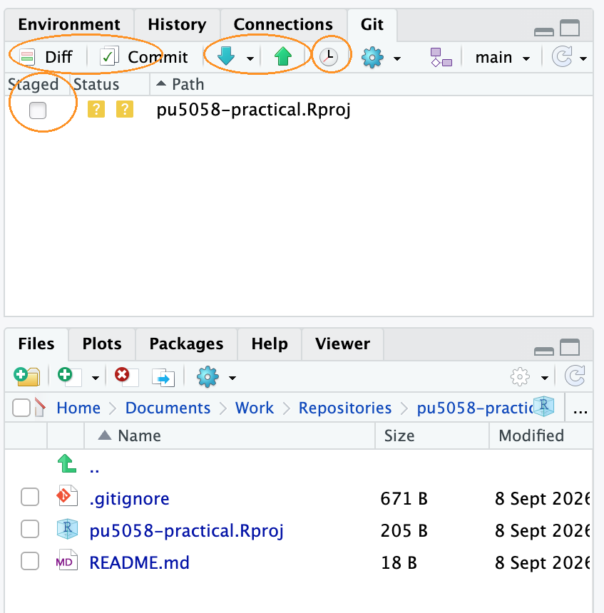{alt="The RStudio Git pane just after cloning, showing one untracked file"}

\  

The coloured icon beside a file tells you what Git currently makes of it. A yellow `?` means Git can see the file but isn't keeping track of it, which is the case for `pu5058-practical.Rproj` right now. You'll meet a blue `M` for a file that's been modified and a green `A` for one you've staged as you work through the next few questions. Here is the full set:

{alt="The Git status icons and what each one means"}

\  

\  

4\. Time to make your first commit, slowly. First you'll need something worth saving, and rather than invent something you'll use the report you built in Exercise 7.

a) That report needs two folders alongside it to knit, so using your computer's file manager (Finder on a Mac, File Explorer on Windows) copy all three of these into your new Project folder:

- `cardiac_report.Rmd` itself
- a `data` folder containing `cardiacdata.txt`
- an `output` folder containing `ex6_admissions.png`

The paths written inside the report are relative to the `.Rmd` file, so those two folders have to keep their names and sit right next to it. You're copying rather than moving because this is a different Project from the one you've been working in. If you haven't got a working report of your own, download the finished one from the [Exercise 7 solutions](exercise_7_solution.html){target="_blank"}.

b) Open `cardiac_report.Rmd` in RStudio and knit it. Do this before you go anywhere near Git, so that you know it works in its new home. Knitting also produces `cardiac_report.pdf`, which you'll come back to in Q7.

c) Now look at the Git pane. Several things have appeared, all with a yellow `?`, because Git can see them but isn't keeping track of any of them yet. Tick the **Staged** box next to `cardiac_report.Rmd` and that one only. Its icon changes to a green `A`, for 'added'. Leaving the others alone is the point here: you choose what goes into a commit rather than sweeping up everything that happens to be lying around.

d) Click **Commit**. A window opens showing the file you staged and, underneath, every line you're about to record. Type a message in the box on the right. Make it say why you made the change rather than just what you changed. 'add cardiac report from Exercise 7' is a useful message, 'update' is not, and in six months you'll be grateful. Click the **Commit** button, read the confirmation, and close it.

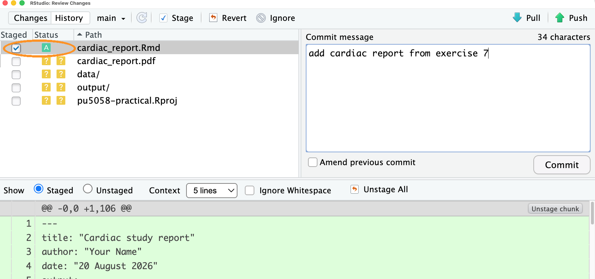{alt="The commit window with one file staged, a message typed and the diff below"}

\  

Your report is now recorded in the history, and notice that it all happened on your own computer. Nothing has gone anywhere near GitHub yet, and nothing needs to until Q8.

A line has also appeared at the top of the Git pane saying that your branch is ahead of 'origin/main' by 1 commit. `origin/main` is Git's name for GitHub's copy of your work, and that line is Git telling you the two copies have drifted apart. The number will go up each time you commit, and it goes back to nothing when you push in Q8.

\  

5\. Now do it again, because the loop only becomes useful once it's automatic. Open `cardiac_report.Rmd`, find the sentence in your data description that begins 'These data come from a cohort study', and reword it to say that the study is unpublished. Save the file. It reappears in the Git pane, this time with a blue `M` for 'modified'.

a) Before you commit, select the file and click **Diff**.

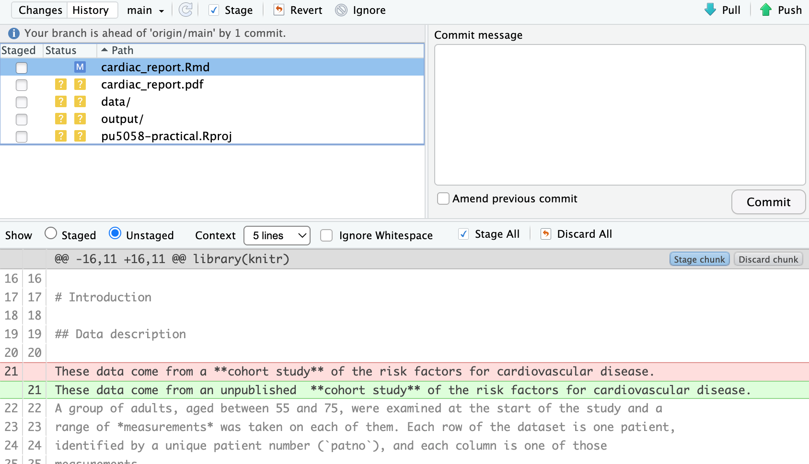{alt="The Review Changes window showing one removed line in red and one added line in green"}

\  

Read what it shows you. Added lines are green, removed lines are red, and the unchanged lines around them are there for context. Notice that Git has recorded your reworded sentence as one line removed and one line added, because Git works a line at a time and has no idea that the two are almost the same. Getting into the habit of looking at the diff before committing catches an enormous number of mistakes.

Notice too that the diff is of your `.Rmd` file rather than the PDF. Git is designed for plain text, which is exactly what an R markdown file is, and it is one of the reasons for writing a report this way rather than in Word.

b) Stage it and commit it with a sensible message, again without pushing.

c) Now click **History**, the clock icon. You'll see your two commits at the top, most recent first, with the `Initial commit` that GitHub made for you sitting underneath them. Click on the top one and the panel below fills in with the details of just that commit, including the changes it contained and its **SHA**, the long string of letters and numbers that is the commit's name. You'll come back to that panel in Q10.

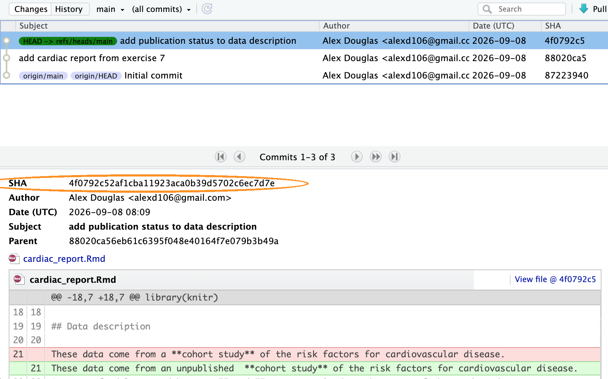{alt="The History window showing three commits, with the details of the selected one in the panel below"}

\  

This history is the part that makes version control worth the trouble. The backup is useful, but being able to look back at what you did, and why you did it, is more useful still.

\  

6\. Everyone makes changes they wish they hadn't. Git gives you a way back.

a) Open your report, delete the whole `chol-plot` chunk that draws the boxplot, and save it. Do **not** commit. Now click on `cardiac_report.Rmd` in the Git pane to select it, click the blue gear icon along the top of the pane and choose **Revert...**. Say yes to the warning, then look at your report again and the deleted chunk is back.

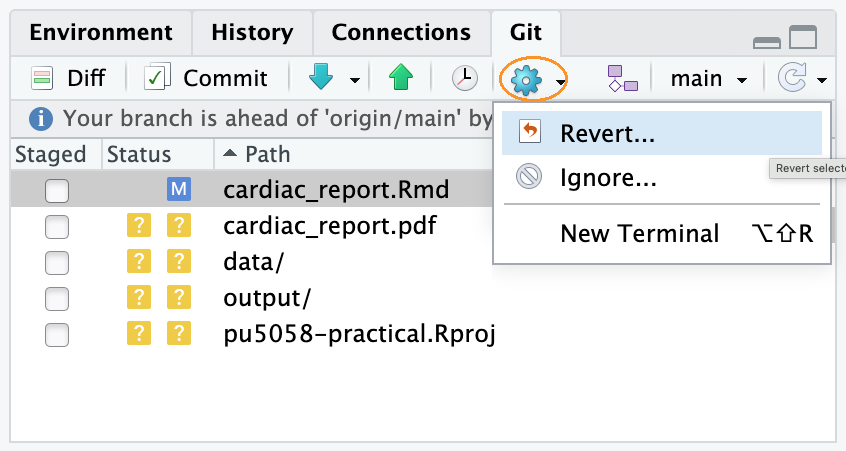{alt="The gear menu in the Git pane, open, showing Revert and Ignore"}

\  

Be careful with this one. It's not an undo button. It throws away *everything* you've changed since your last commit, not just the last thing you did, and there's no way back. Commit often and you'll rarely need it.

b) Now a subtler one, and this time do exactly as follows so that you can see what changes.

In your report, find the `## Results` heading and change it to something more useful, say `## HDL cholesterol and smoking status`. Save the file, stage it, and commit it with the message `change Results heading`.

Now realise you meant to do more than that. Underneath that heading, add a sentence saying what the figure below it shows. Save the file and stage it again, but this time, before you click **Commit**, tick **Amend previous commit**. Notice that RStudio fills the message box back in with `change Results heading` for you. Commit.

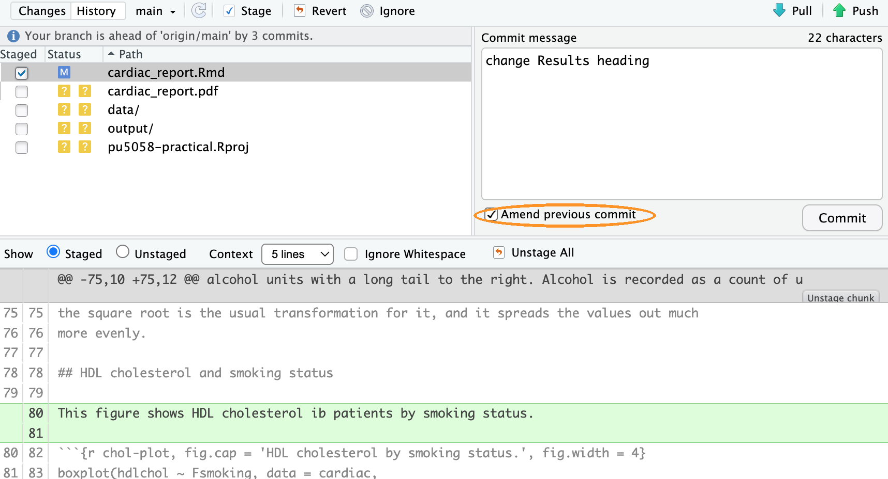{alt="The commit window with the Amend previous commit box ticked"}

\  

Click **History** and count. You made two separate changes and clicked Commit twice, but there is only one new commit, holding both of them. That is what amending does: rather than adding a commit, it replaces the previous one.

You are safe doing this here because you haven't pushed anything yet. Once a commit is on GitHub other people may already have it, and rewriting one at that point causes them problems, so treat **Amend previous commit** as something you only ever use on work that is still on your own machine.

\  

7\. Before you send any of this to GitHub, decide what should be going. Open the `.gitignore` file in your Project. This is the list of things Git deliberately ignores, and GitHub gave you a sensible starting one when you chose the R template in Q2.

a) Read through it. You should recognise `.Rhistory` and `.RData`.

b) Look back at the Git pane. `cardiac_report.pdf` is still sitting there with a yellow `?` from Q4, and it will reappear every time you knit. It doesn't need a history, because anybody with your `.Rmd` file and the data can produce it again in one click. Add a line to `.gitignore` that ignores it and watch it disappear from the pane.

`````{asis, echo=SOLUTIONS}
````{.md .foldable}
cardiac_report.pdf
````

Or, to catch every PDF the Project ever produces:

````{.md .foldable}
*.pdf
````
`````

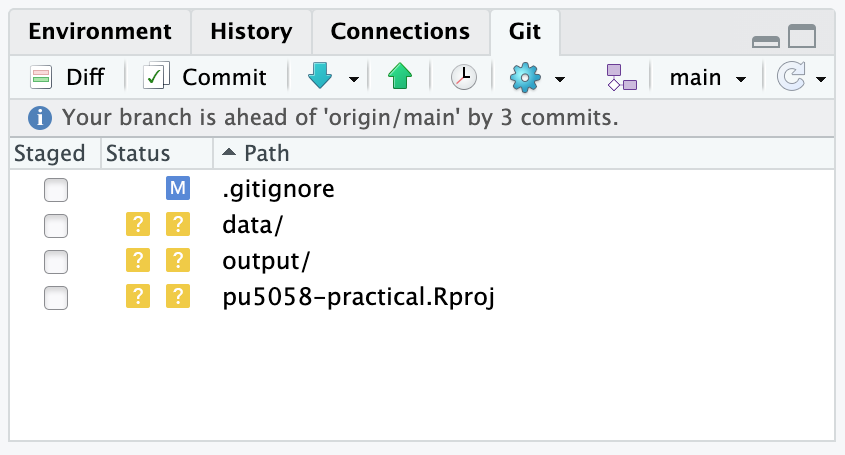{alt="The Git pane after the gitignore edit, with the PDF gone and gitignore now showing M"}

\  

If you're on a Mac you may also see a file called `.DS_Store` in the pane, which Finder writes into every folder you open and which has nothing to do with your work. Add that to `.gitignore` too.

c) Notice that the gear menu you used in Q6 also has an **Ignore...** option, which adds the selected file to `.gitignore` for you rather than making you type it.

d) Now a judgement call, because 'ignore anything you generated' is too blunt a rule. Your `output` folder holds `ex6_admissions.png`, and your report can't knit without it. If you ignored that folder, anybody who cloned your repository would get a report that fails on the last figure. The question to ask is not 'did I generate this?' but 'could somebody rebuild it from what is already in the repository?'. The PDF, yes. The png, no, because you made it in a different Project from data that isn't here.

e) Last of all, think about your data. `cardiacdata.txt` is small, unchanging and not confidential, so committing it is reasonable and makes the project self-contained. Real patient data would be a different matter entirely. **Never put confidential data or passwords in a repository**, and be especially careful with public ones, because deleting a file doesn't remove it from the history.

f) So put that into practice. `data/`, `output/` and `pu5058-practical.Rproj` have been sitting there untracked since Q4, and all three belong in the repository. The first two because the report needs them, and the third because it is what makes the folder an RStudio Project for anybody who clones it.

Stage those three and the `.gitignore` you just edited, commit them with a sensible message, and look at the Git pane afterwards. It should be completely empty. Everything you wanted is now in the history and everything you didn't is being ignored, which is exactly the state you want a project to be in before you send it anywhere.

\  

8\. Stop for a moment before you click anything. **Everything you have done up until now has been local.** Every commit you made in Q4 to Q7 went into a hidden folder inside `pu5058-practical` on your own computer, and GitHub has no idea that any of it happened. Refresh your repository page in the browser and you'll still see nothing but the README and the `.gitignore` you made back in Q2.

That's worth noticing, because it's the difference between the two halves of this exercise. Git gave you the history. GitHub is about to give you the backup, and everything from here on is about keeping the two in step.

Click the green **Push** arrow, the up arrow in the Git pane. A window opens showing you what Git did.

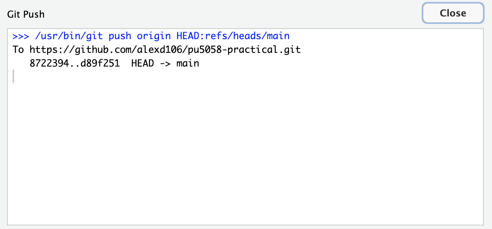{alt="The Git Push window reporting a successful push to the repository on GitHub"}

\  

Wait for it to finish, close it, then go to your repository page on GitHub in your browser and refresh.

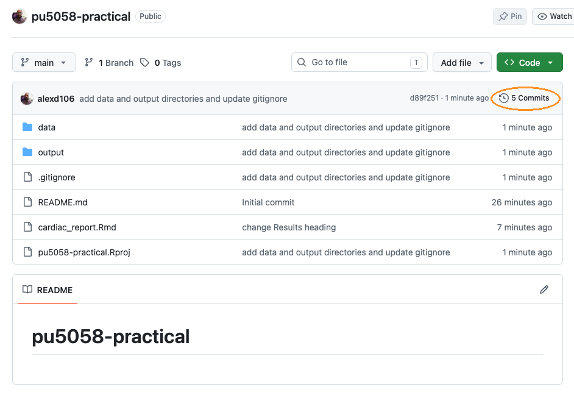{alt="The GitHub repository page after pushing, showing the report, the data and output folders and the commit count"}

\  

Your report is there, and so are the data, the figure and the `.Rproj` file, which means somebody could clone this repository and knit your report themselves. So is every commit you made along the way, not just the last one. Push sends everything Git has that GitHub hasn't. Click on the commit count near the top of the file list and you will see them all, with the messages you typed. Back in RStudio, the line telling you that your branch was ahead of `origin/main` has gone, because the two copies now match.

If the push fails with a message about authentication then your token is the problem rather than anything you've done here, and see the last section of the [setup page](git_setup.html){target="_blank"}. Everything you have committed is safe on your computer either way, which is rather the point of keeping the two separate.

\  

9\. Once more round the loop, and this time all the way through to GitHub without stopping. Change, look, stage, commit, push. That sequence is what you'll be doing every day, so it's worth doing once from end to end now that you know what each step is for.

a) Open `cardiac_report.Rmd` and add a sentence of your own at the very end, under the last figure, saying what you would look at next if you had more time. Save the file.

b) Click **Diff** and read the change, then stage the file and commit it with a message saying what you added and why.

c) Before you push, click **Pull**, the blue down arrow. You'll get a short message telling you that everything is already up to date, which is exactly what you'd expect. You're the only person working on this repository, and the only things on GitHub are the things you put there yourself.

It's still the habit to get into. When you're working with other people, they'll have been committing while you were, and pulling their work down before you send yours up is what keeps the two copies in step. If you both change the same lines of the same file and neither of you pulls first, Git can't tell which version is right and asks you to sort it out. That's a merge conflict, and sorting one out is a lot more work than the click you skipped. **Pull before you push**, even when, as today, there's nothing to pull.

d) Now click **Push**, and refresh your repository page on GitHub. One more commit, and your sentence is there at the bottom of the report.

\  

10\. Last of all, the question everybody gets to sooner or later. You've pushed something, and then realised it shouldn't have gone.

You've already met two ways of undoing things and neither of them will do here. **Revert...** in the gear menu, from Q6a, throws away changes you haven't committed yet, and this one is committed. **Amend previous commit**, from Q6b, rewrites your last commit, which is only safe while it's still on your own computer, and this one is on GitHub. What you need is something that undoes the change without pretending it never happened.

That something is `git revert`, which adds a *new* commit that is the exact opposite of an old one. The original stays in the history, the new one cancels it out, and anybody who already has your work simply gets one more commit. Be careful with the name, because RStudio's **Revert...** button and the `git revert` command do quite different jobs and only share a word. There's no button for `git revert` in RStudio, so this is the one place in this exercise where you type a Git command yourself.

a) First, look at the Git pane and make sure it's empty. `git revert` won't run if you have uncommitted changes lying around. If you have any, commit them.

b) Now find the commit you want to undo, which is the one you made in Q9. Click **History**, the clock icon, and click on that commit. Its full **SHA** appears in the panel underneath, a long string of letters and numbers that is the commit's name. You only need the first seven or eight characters, so copy those, or just write them down.

c) Open the Terminal. It's the tab next to the Console in the bottom left pane, and if it isn't there, use `Tools` -> `Terminal` -> `New Terminal`, or Shift+Alt+R (Option+Shift+R on a Mac). The Terminal isn't the R console. It talks to your computer directly rather than to R, so R commands won't work in it.

d) Type this, with your own SHA in place of the one below, and press enter:

```
git revert --no-edit 1b0f779
```

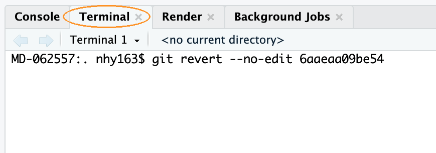{alt="The RStudio Terminal tab with the git revert command typed in"}

\  

The `--no-edit` part matters. Without it Git opens a text editor so that you can write a commit message, and the editor it opens is one that's genuinely hard to get out of if you've never met it. With it, Git writes a sensible message for you. Since the commit you're undoing is the most recent one, you could also have written `git revert --no-edit HEAD`, because `HEAD` is Git's name for wherever you are now.

e) Look at your report. The sentence you added in Q9 has gone. Look at the Git pane and you're one commit ahead of GitHub again, although you may have to click the refresh icon, the circular arrow on the right of the pane, before RStudio notices what you did behind its back. Click **History** and you'll see both commits, the one that made the change and the one that undid it, so the record of what happened is complete.

f) Push, and refresh GitHub. The report is back to how it was before Q9, and the history says why.

This is the general answer for anything that's already public. Once a commit has been pushed, you undo it by adding another commit rather than by taking one away.

\  

### Where to go next

\  

Git can do a great deal more than this. **Branches** let you work on something risky without disturbing the version that works. **Forks** and **pull requests** are how people contribute to each other's projects. **Merge conflicts**, the ones described in Q9, have a set of tools of their own once they get beyond the straightforward. None of that is needed for this course, and all of it is easier to learn once the everyday loop in this exercise is second nature.

When you want to go further, the standard reference for R users is [Happy Git and GitHub for the useR](https://happygitwithr.com), which is free online. Section [9.6.4](https://intro2r.com/use_git.html) of the Introduction to R book gives an overview of how collaboration works.

One last thing. The website you're reading this on is built from a public GitHub repository, using exactly the tools in this exercise. The **Source code** link in the menu at the top of this page will take you to it.

\  

End of Exercise 9
