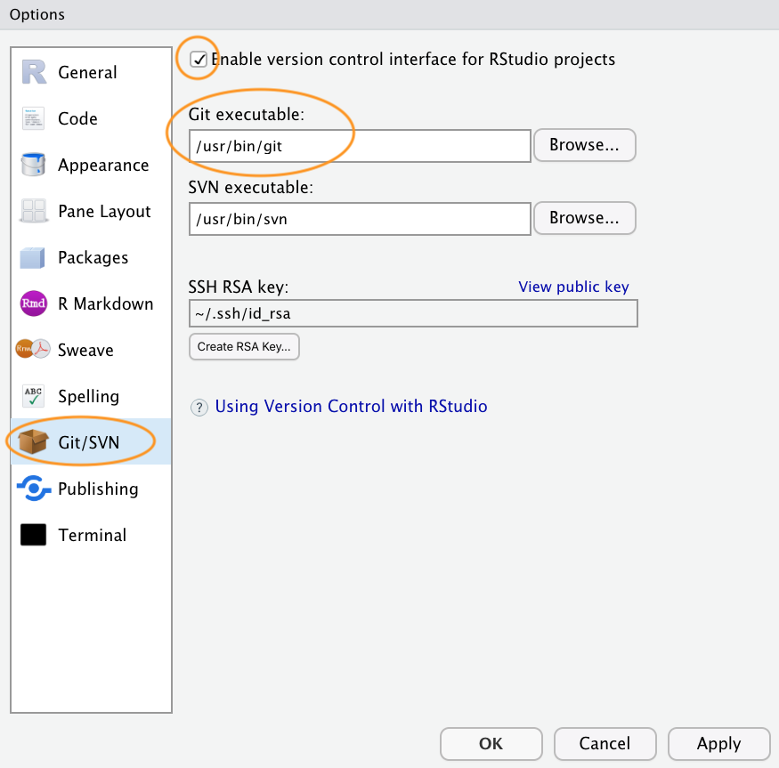
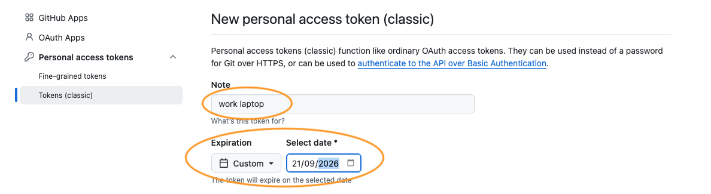
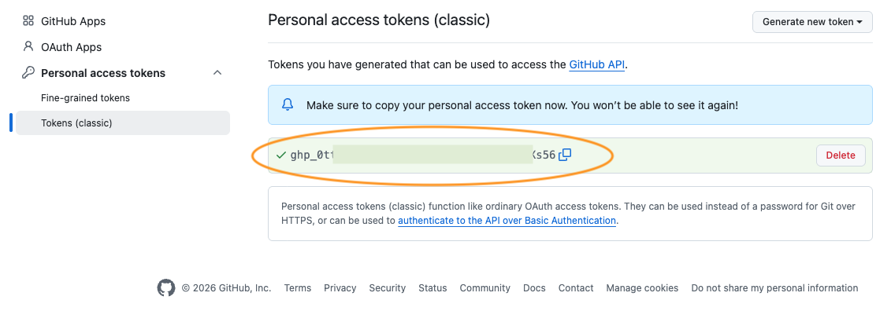

\  

## Before you start

**You don't need this at the start of the course.** It's needed for Exercise 9, and there's no advantage in doing it earlier. The access token you create in Step 5 has a limited life, so setting it up months in advance only means renewing it sooner.

\  

This page gets your computer talking to GitHub. It takes about half an hour and it's
fiddly the first time, which is why we ask you to do it **before** the Exercise 9
practical rather than during it.

Please work through it beforehand. If you hit a real problem, bring it to the start of the
session and we'll help you, but we can't get everybody set up and still have time to teach
anything, so do try first.

You only ever do this once per computer.

\  

## Step 1: Install Git

Git is a separate program from R and RStudio, and you need it installed before RStudio can
use it. There is a fuller version of these instructions in [Appendix B](https://intro2r.com/install_git.html)
of the Introduction to R book.

**Windows.** Download [Git for Windows](https://gitforwindows.org/) and run the installer.
There are a lot of screens and you can accept every default on all of them. The installer
also adds a program called Git Bash, which we won't use on this course but which does no
harm.

**macOS.** The simplest route is to let your Mac install it for you. Open the Terminal
application (press Cmd+Space, type `Terminal`, press Enter), type `git --version` and press
Enter. If Git isn't installed, macOS will offer to install the command line developer
tools. Accept, and wait for it to finish. This is the only time on this course you'll need
the Terminal. If you'd rather use an installer, there's one at
[git-scm.com](https://git-scm.com/download/mac).

**Linux.** Git is often installed already. Check with `git --version`. If not, use your
package manager: `sudo apt install git` on Debian or Ubuntu, `sudo dnf install git` on
Fedora.

\  

## Step 2: Create a GitHub account

Git runs on your computer. GitHub is a website that stores copies of your work and is what
makes it a backup rather than just a filing system.

Sign up for a free account at [github.com/join](https://github.com/join). You need a
username, an email address and a strong password. Choose a username you'd be happy for a
future employer to see, because quite a lot of people put their GitHub profile on a CV.

Two-factor authentication is a good idea and takes about five minutes to set up with an
authenticator app on your phone. It's **not** required for what we're doing, so don't let
it hold you up now. You can add it later from your GitHub account settings.

\  

## Step 3: Tell RStudio where Git is

Open RStudio and go to `Tools` -> `Global Options` -> `Git/SVN`.

Check that **'Enable version control interface for RStudio projects'** is ticked, and that
the **'Git executable'** box has a sensible path in it. On Windows this usually ends in
`git.exe`, on macOS and Linux in `git`.

If the box is empty, click `Browse...` and find the program you installed in Step 1. Restart
RStudio afterwards.



\  

## Step 4: Tell Git who you are

Git labels every change you make with a name and an email address, so you need to give it
those once.

You may have seen this done in a terminal. We'll use the `usethis` package instead, so
that everything happens in the R console you already know. Install it first if you haven't
already:

```{r step4a, eval=FALSE}
install.packages("usethis")
```

Then:

```{r step4b, eval=FALSE}
library(usethis)

use_git_config(user.name = "Your Name", user.email = "you@example.com")
```

Use the same email address you signed up to GitHub with. The name is what will appear
against your changes, so use your real one.

That `library(usethis)` line lasts as long as your R session and no longer, so if you come
back to this page in a few weeks you'll need to run it again before any of these functions
will work.

While you're here, set the default name for the main line of work in new projects:

```{r step4c, eval=FALSE}
use_git_config(init.defaultBranch = "main")
```

GitHub has called this `main` since 2020. Git itself still uses the older name `master`
unless you tell it otherwise, and the mismatch causes confusing errors later. You'll meet
both names in the wild.

\  

## Step 5: Create a personal access token

This is the step people get stuck on, so it's worth reading carefully. [Section 9.4.5](https://intro2r.com/setup_git.html#github-auth)
of the Introduction to R book covers the same ground.

When you send your work to GitHub, it needs to know it's really you. GitHub **stopped
accepting your account password for this in 2021**. Instead you use a *personal access
token*, which is a long string of characters that works like a password for one computer,
and which you can cancel without changing anything else about your account.

Run:

```{r step5, eval=FALSE}
create_github_token()
```

This opens GitHub in your web browser with a form already filled in with the right
permissions. Before you click the green **Generate token** button at the bottom, change two
things:

1. **Note**: replace whatever is there with something that will still mean something to you
   in six months, such as `PU5058 laptop`.

2. **Expiration**: click the dropdown and choose `Custom`, then pick a date about six months
   from now. GitHub suggests 30 days by default. Thirty days is better security practice,
   but it means your token stops working part way through this course, probably at the worst
   possible moment. We're deliberately trading a little security for not being locked out
   when you most need it. When you finish this course, go back to shorter-lived tokens.



Now click **Generate token**. GitHub shows you the token exactly once, on a green
background. Copy it now. If you navigate away without copying it you can't get it back and
will have to make another one, which is annoying but harmless.



\  

## Step 6: Store the token

Give the token to your computer's password store so you never have to type it again:

```{r step6, eval=FALSE}
library(gitcreds)

gitcreds_set()
```

Paste the token when prompted and press Enter. You already have `gitcreds`, because it
comes along with `usethis`, so there's nothing extra to install. If R tells you there is no
such package, run `install.packages("gitcreds")` and try again.

\  

## Step 7: Check it all worked

```{r step7, eval=FALSE}
git_sitrep()
```

`git_sitrep()` is short for 'Git situation report'. It prints everything about your setup in
one go, including which Git you have, the name and email you set in Step 4, and whether it
can find and use your token.

Read the output even though nothing has gone wrong. Knowing what it looks like when things
are healthy is what makes it useful later on when they aren't. The lines to check are your
name and email, and a line confirming a personal access token was found.


If anything looks wrong, go back to the step that set it. If you can't see what's wrong,
bring the `git_sitrep()` output to the session and we'll look at it together.

\  

## When your token expires

Your token will expire eventually. This is normal and nothing is lost when it happens.

The symptom is that pushing or pulling, which worked perfectly well last week, suddenly
fails with a message about authentication. The fix is to repeat Steps 5 and 6. You'll be
doing this in a new R session, weeks or months later, so load the two packages again first:

```{r expired, eval=FALSE}
library(usethis)
library(gitcreds)

create_github_token()   # generate a fresh one
gitcreds_set()          # it will offer to replace the old one - say yes
git_sitrep()            # check
```

Your work is on your computer and on GitHub throughout, so an expired token is a five
minute annoyance rather than a disaster.

\  

## Where to go if you are stuck

The standard reference for R users is [Happy Git and GitHub for the useR](https://happygitwithr.com),
which covers everything on this page in far more detail, including what to do when the
usual routes don't work.
